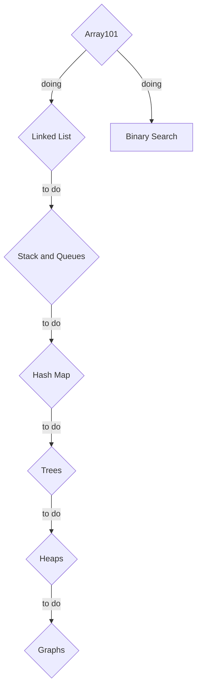

# Leetcode Challenge

### 1. Sean Prashad List
- https://seanprashad.com/leetcode-patterns/
- Completed all easy and medium
- Re-did all easy, re-doing medium now

### 2. Binary Search Study Plan
- To complete all 3 parts

---
### Roadmap

- `Rhombus` indicates Data Structures
- `Rectangle` indicates Algorithms

