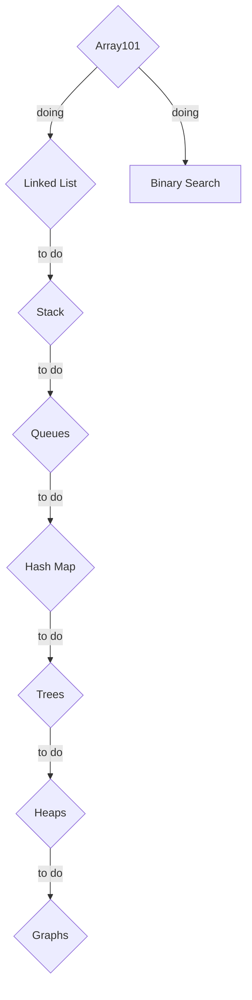

# Leetcode Challenge

### W1 (2022-05-30 - 2022-06-05)
- To complete Array 101 with Python

### W2 (2022-06-13 - 2022-06-19)
- To complete Linked List with Python
- To complete Binary Search with Python

---
### Roadmap

- `Rhombus` indicates Data Structures
- `Rectangle` indicates Algorithms

